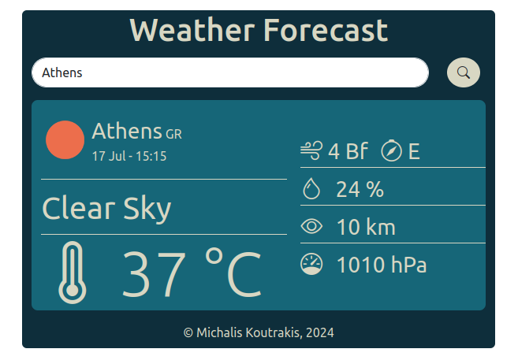

# Weather Forecast

A simple app that shows the current weather for a given city.

## Note

To use this app, please insert your API key from OpenWeather (https://openweathermap.org/api) into the `WEATHER_API_KEY` variable inside the `getWeather()` function in the `main.js` file.

For example, if your API key is `"1a2b3c"`:

```javascript
function getWeather(cityName) {
    ...
    let WEATHER_API_KEY = "1a2b3c"
    ...
}
```
Below is a screenshot of the app in action:



